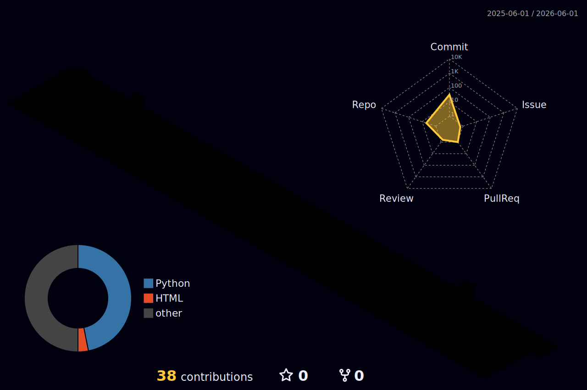

<!-- ANIMATED HEADER -->

<!-- TYPING SVG -->

  

<!-- BADGES -->

  
  &nbsp;
  
  &nbsp;
  
  &nbsp;
  

---

## ✨ Quote of the Day

<!--QUOTE_START-->
> The people who are crazy enough to think they can change the world are the ones who do. — Steve Jobs
<!--QUOTE_END-->

---

## 📊 GitHub Stats

  
  &nbsp;
  

  

  

<!-- 3D CONTRIBUTION GRAPH — auto-generated by GitHub Actions workflow -->

  

---

## 👨‍💻 About Me

I'm a computer engineer passionate about projects that take on real-world problems and turn data into learned solutions. My work spans embedded systems, machine learning, and software built for the public good.

Traveling to **Ghana, Portugal, and Vietnam** shaped how I think about access and community — and continues to drive why I build what I build.

---

## ⚙️ Tools I Use

   
  <b>Python · C++ · C · Java · JavaScript · Bash</b>

   
  <b>Git · GitHub · Linux · Jenkins · VS Code · Flask</b>

   
  <b>MySQL · TensorFlow · Arduino · MATLAB</b>

---

## 🌍 Community and Purpose

> Engineering is most powerful when it serves people who need it most.

I care about using technical knowledge to support underrepresented communities and create more access, representation, and opportunity in STEM. One of my long-term goals is mentorship — helping the next generation of engineers find their place in this field.

---

  
<strong>📈 Recent GitHub Activity</strong>

   

  <!--START_SECTION:activity-->
  <!--END_SECTION:activity-->

---

<!-- FOOTER WAVE -->

