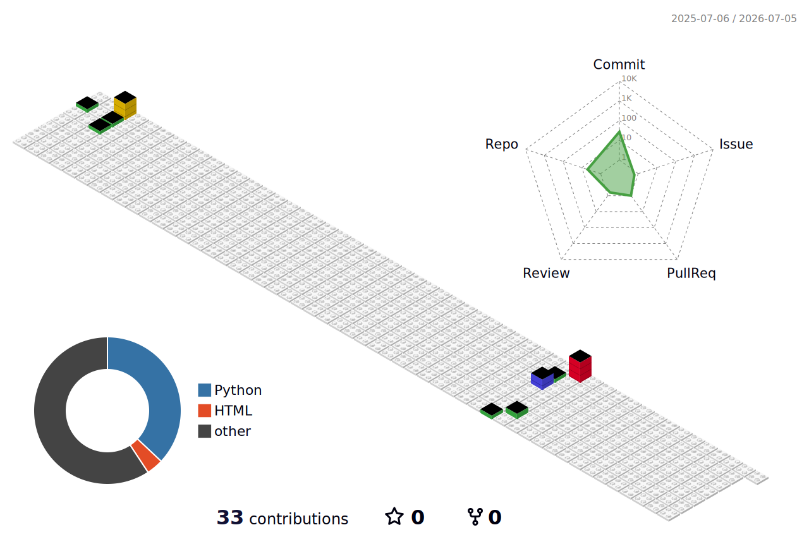

# Hi, I'm Guarien 👋

- 👨‍💻 Computer Engineering student at NYU who loves working on projects that challenge and inspire me
- 🔭 Currently building in embedded systems and machine learning
- 🌱 Expanding into systems programming and applied ML on real-world data
- 💬 Ask me about Python, embedded systems, or building for social impact
- 🌍 Traveled to Ghana, Portugal, and Vietnam — it shaped how I think about engineering
- ⚡ Fun fact: I love marathon running and rock climbing as much as I love coding

### 🤝 How to reach me:

<!--QUOTE_START-->
*"The people who are crazy enough to think they can change the world are the ones who do." — Steve Jobs*
<!--QUOTE_END-->

### 📊 Coding Stats

<!--START_SECTION:readme-info-->
<!--END_SECTION:readme-info-->

### 🛠️ Languages and Tools:

### Most Used Languages:

### 📈 GitHub Stats:

### 🧱 Contribution Graph:

  
<strong>📈 Recent GitHub Activity</strong>

   

  <!--START_SECTION:activity-->
  <!--END_SECTION:activity-->

